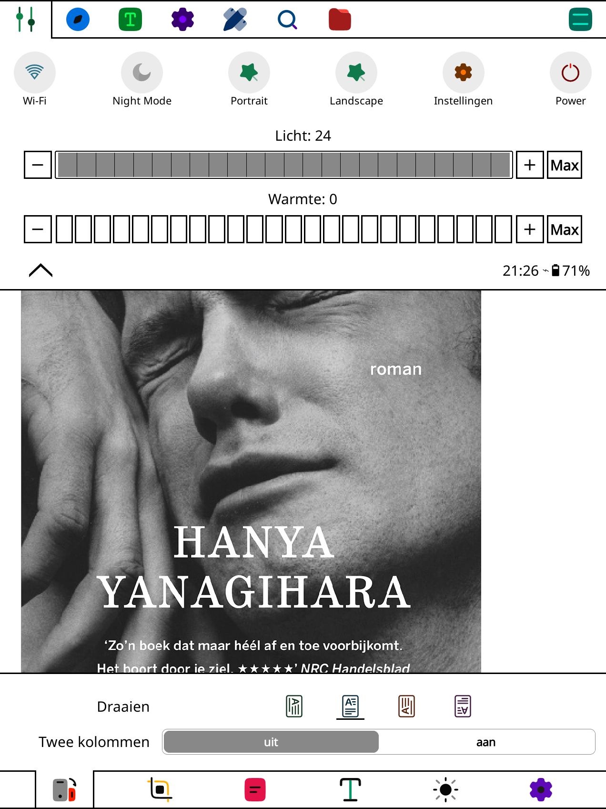

**Solar Colorsoft**

A colorful icon pack for KOReader and SimpleUI, designed for color e-ink displays.

 

 

 

### Install

First download and extract the main Solar_Colorsoft.zip file.

*KOReader*

Copy the SVG files from KOReader/icons/ to the "icons" folder in your KOReader data directory. If the folder doesn't exist, create it. Finally, restart KOReader.

*SimpleUI*

Install `Solar Colorsoft SimpleUI - Install Pack.zip` from **Settings > Style > Icons > Icon Packs > Install pack from ZIP**.

### Credits

Based on Solar Icons by 480 Design and selected KOReader icon resources.

Solar Icons:  
https://github.com/480-Design/Solar-Icon-Set

KOReader:  
https://github.com/koreader/koreader

Solar Colorsoft adaptation: Jeffrey.

### Use

Please don't use my Solar Colorsoft modifications commercially. Original icons remain subject to their original licenses.

Original icons created for Solar Colorsoft may not be used commercially without permission.
